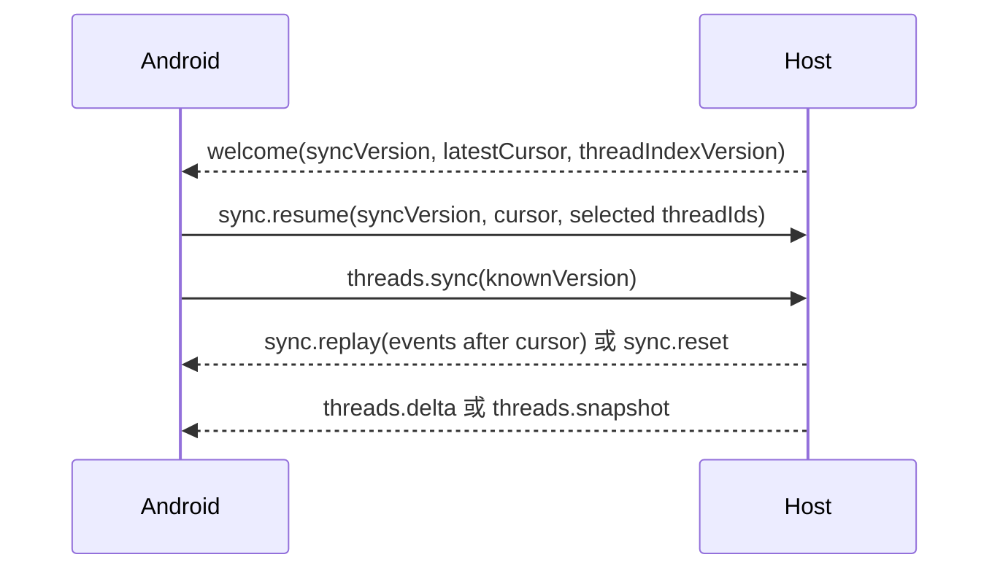

# v0.3 增量同步协议

日期：2026-07-25

## 问题与证据

旧协议在每次 WebSocket 建连后都重新扫描并发送任务全集，客户端还会再次请求一次 `threads.list`；打开任务时会加载完整 turns。在带宽受限的公网反向代理环境中，重复全量传输会导致每次进入或重连长时间等待。

v0.3 公网实测（456 个任务）：

```text
FIRST frames=3 bytes=1916913 threads=456
RECONNECT frames=3 bytes=437 delta_upserts=0 replay_events=0
RATIO 0.000228 reduction=99.98%
```

公开仓库不提交生产端点原始日志；可用本文末尾命令在自己的 Host 上复现。

## 建连与恢复流程



### `welcome`

新增字段：

- `syncVersion`：Host 本次运行周期的 journal 标识。
- `latestCursor`：当前事件流水号。
- `threadIndexVersion`：任务索引版本。

Host 建连时不再主动发送任务全集。

### `sync.resume`

客户端提交：

- 上次 `syncVersion`；
- 已消费的 `cursor`；
- 当前仍需接收内容事件的任务 ID，最多 20 个。

若版本一致且 cursor 尚在保留窗口内，Host 返回 `sync.replay`；否则返回 `sync.reset`。journal 默认最多保留 2000 个事件且总 JSON 大小不超过 5 MiB；任一限制触发时淘汰最早事件。

### `threads.sync`

- 首次同步或版本不可用：`threads.snapshot`。
- 版本仍在变更窗口内：`threads.delta { upserts, removedIds }`。
- 客户端按任务 ID 合并并去重。

任务索引变更历史默认保留 2000 个变更版本。

## 任务内容订阅

- `thread.open` 同时订阅任务实时内容。
- `thread.close` 取消订阅。
- turn、Desktop snapshot、Git diff 等任务内容只发给订阅该任务的连接。
- 审批、服务状态等全局事件仍广播。

## 历史分页

`thread.open` 默认只请求最近 20 turns，Host 使用：

```text
thread/resume(excludeTurns: true)
thread/turns/list(limit: 20, cursor)
```

更早历史由客户端点击“载入更早记录”后发送 `thread.history`。客户端携带 `knownTurnIds`，Host 返回时过滤重复 turn。若旧 app-server 不支持 `thread/turns/list`，自动回退 `thread/read(includeTurns: true)`。

## Android 本地缓存

- 优先 IndexedDB，失败时回退 localStorage。
- 缓存 scope = 规范化服务端地址 + Pairing Token 的本地哈希；不同端点/令牌不会混用。
- 缓存任务索引、同步版本/cursor、当前任务、分页状态以及最近 24 个任务的最多 500 条消息。
- 大型 `detail` 字段不持久化。
- 启动先展示缓存，后台进行 cursor/delta 校准，不再先清空 UI。

## 兼容性

- 新客户端 + 旧 Host：`welcome` 无 `syncVersion` 时退回 `threads.list`。
- 旧客户端 + 新 Host：保留 `threads.list` 和旧 `thread.open` 入口。
- Host 重启：`syncVersion` 改变，客户端收到 `sync.reset` 并重新取得 snapshot。
- 无效旧缓存：schema 校验失败后忽略，不阻断实时连接。

## 复现命令

```bash
cd /path/to/codex-mobile-remote
npm run test:public-sync
```

该命令会执行一次首次 snapshot 和一次无变化重连，用 JSON 帧字节数对比；不会打印 Pairing Token。

## v0.3.1 缓存与顺序迁移

v0.3.1 将 Android 缓存 schema 从 2 提升到 3，并把 localStorage fallback key 更新为 `codex-mobile.remote-cache.v3.*`。原因是旧缓存可能已经持久化过按 item ID 字典序产生的错误消息顺序；新客户端会丢弃旧 schema，重新用 canonical turn/item 数组校准，避免修复后仍展示历史错序。

## v0.3.2 缓存 schema 4 与全量刷新

v0.3.2 将缓存 schema 提升到 4，以淘汰可能包含跨来源重复 item 和错误 turn 尾部顺序的旧快照。设置页提供“清空缓存并全量刷新”：

1. 取消尚未写入的缓存定时任务；
2. 清空 IndexedDB snapshot store；
3. 删除所有 `codex-mobile.remote-cache.*` localStorage 版本键；
4. 清空内存中的任务、消息、分页、TODO、队列、Diff、审批和压缩状态；
5. 保留服务器地址和配对令牌；
6. 重建 WebSocket，并以空 version/cursor 重新取得任务索引和当前会话。

该入口是故障恢复工具，不替代协议修复。v0.3.2 已证明“打开会话数秒后旧消息移动到底部”的根因是延迟 Desktop snapshot 与 app-server synthetic item 身份冲突，而不是缓存；即使清缓存/重装也能触发旧 reducer 的错误合并。
